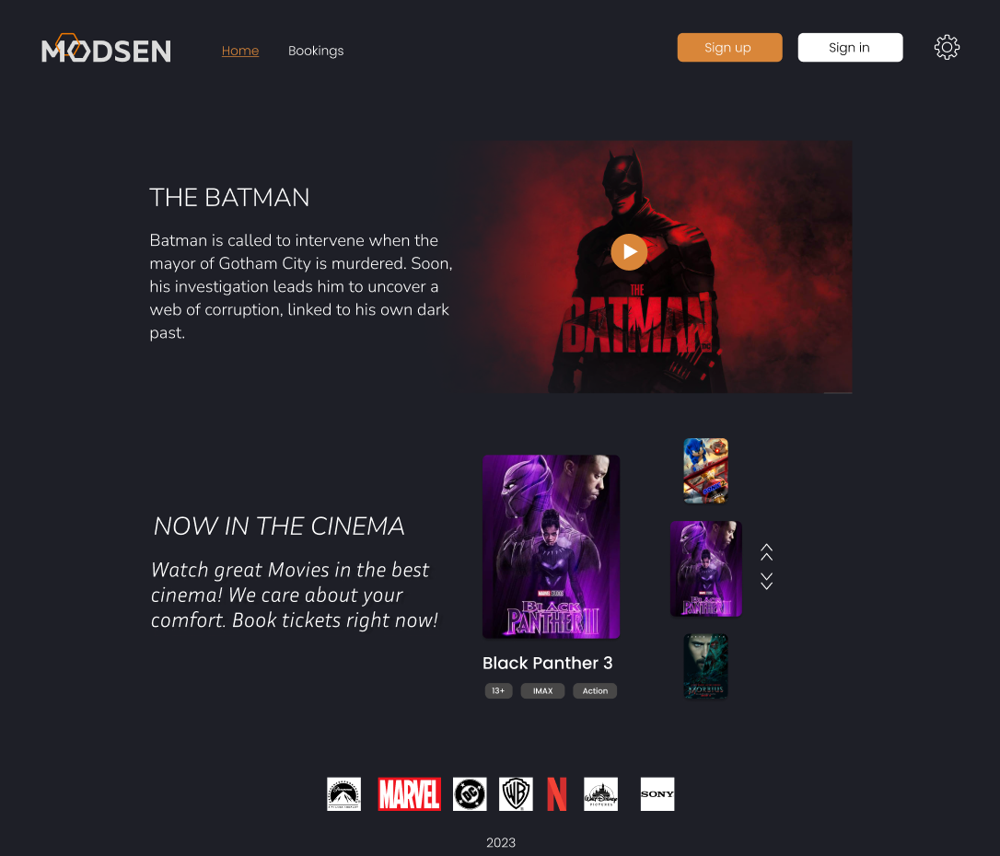
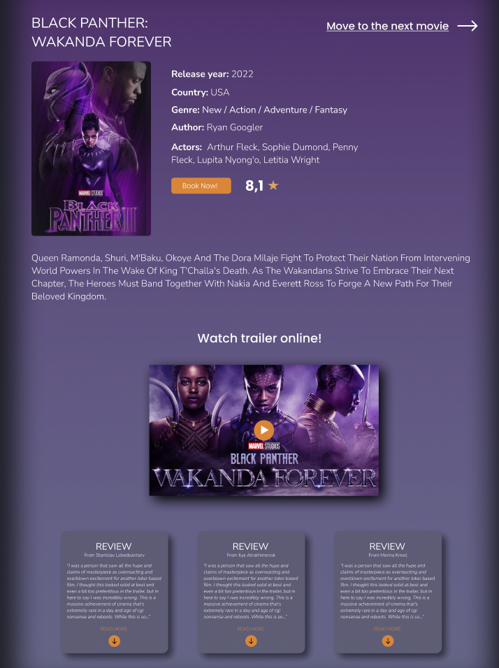
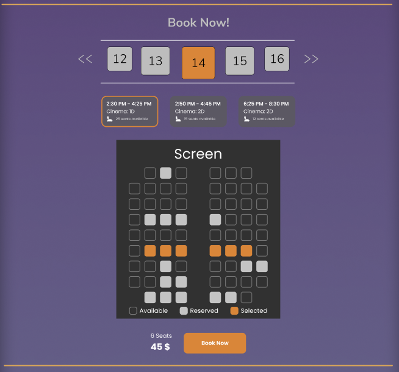
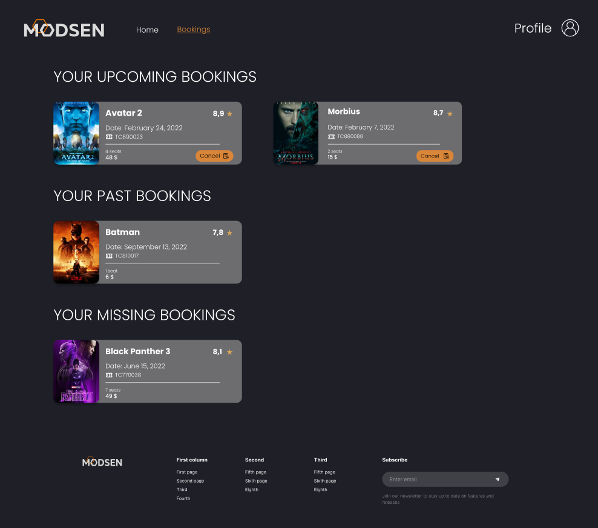

# Cinema React App

## Description

This application provides functionality for booking tickets for different movies in the cinema. User can check current movies, watch their trailers, get information about movie, like its author, actors, country, description, rating and etc. When booking, user can choose date, session and seats to book. At Bookings page user can check his tickets. Also user can edit his profile information, for example, gender and avatar image. Application has English and Russian localization, Dark and Light themes, so user can choose what's best for him.

## Available Scripts

In the project directory, you can run:

### `yarn start`

Runs the app in the development mode.\
Open [http://localhost:3000](http://localhost:3000) to view it in the browser.

The page will reload if you make edits.\
You will also see any lint errors in the console.

### `yarn test`

Launches the test runner in the interactive watch mode.

### `yarn build`

Builds the app for production to the `build` folder.\
It correctly bundles React in production mode and optimizes the build for the best performance.

The build is minified and the filenames include the hashes.\
Your app is ready to be deployed!

## Environment variables

```REACT_APP_EMAILJS_PUBLIC_KEY``` - Public key for email sending service\
```REACT_APP_EMAILJS_SERVICE_ID``` - Email sending service id\
```REACT_APP_EMAILJS_TEMPLATE_ID```- Email template id for email sending service

Leave the other variables unchanged.

```
GENERATE_SOURCEMAP=false
REACT_APP_EMAILJS_PUBLIC_KEY=YOUR_PUBLIC_KEY
REACT_APP_EMAILJS_SERVICE_ID=YOUR_SERVICE_ID
REACT_APP_EMAILJS_TEMPLATE_ID=YOUR_TEMPLATE_ID
```

## Screenshots

### Home page



### Movie page



### Booking


### Tickets page
